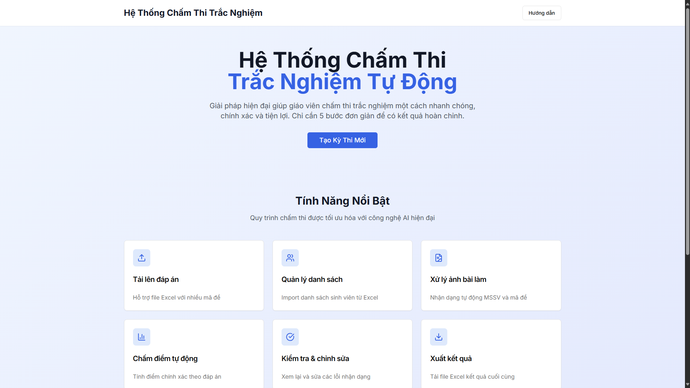
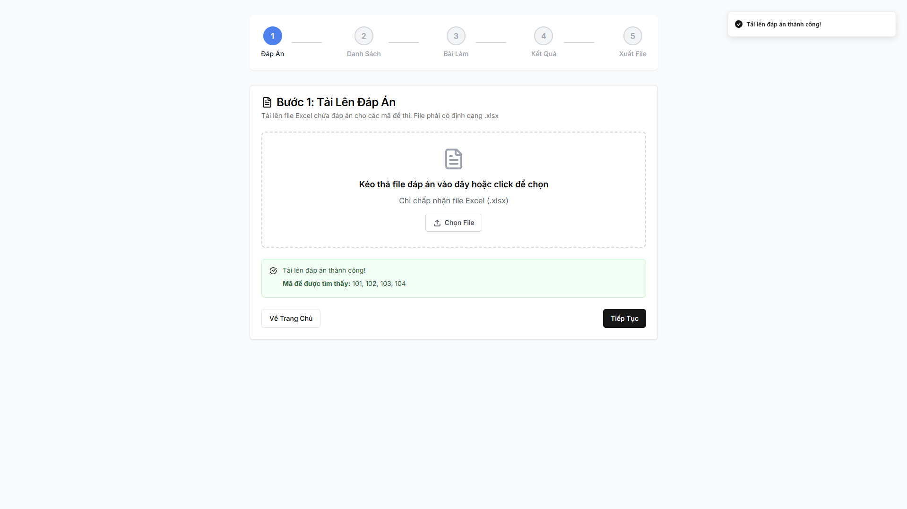
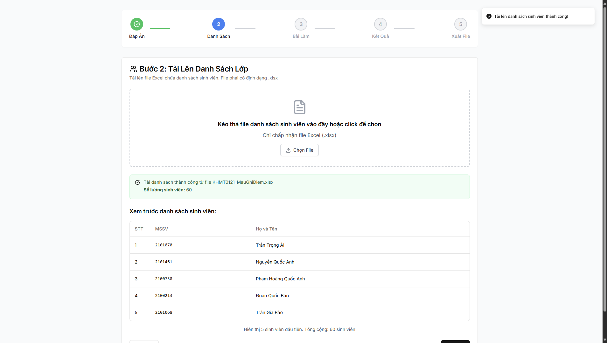
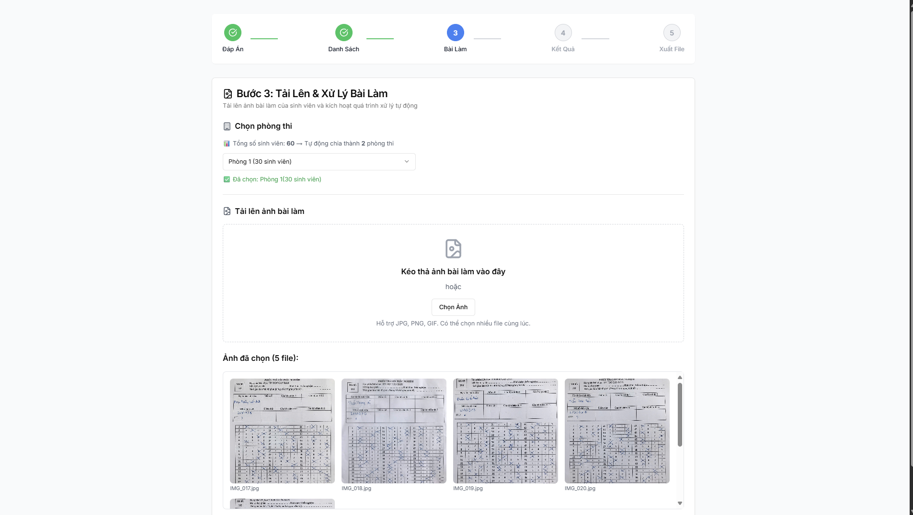
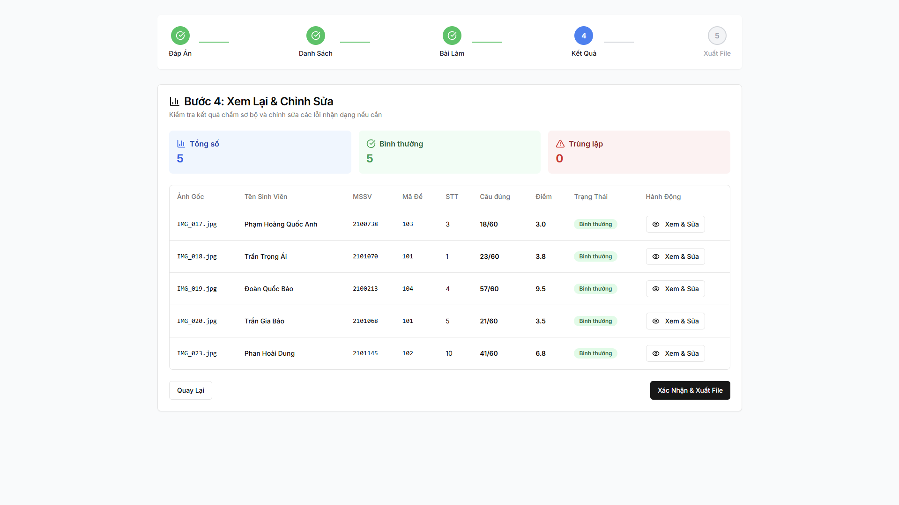
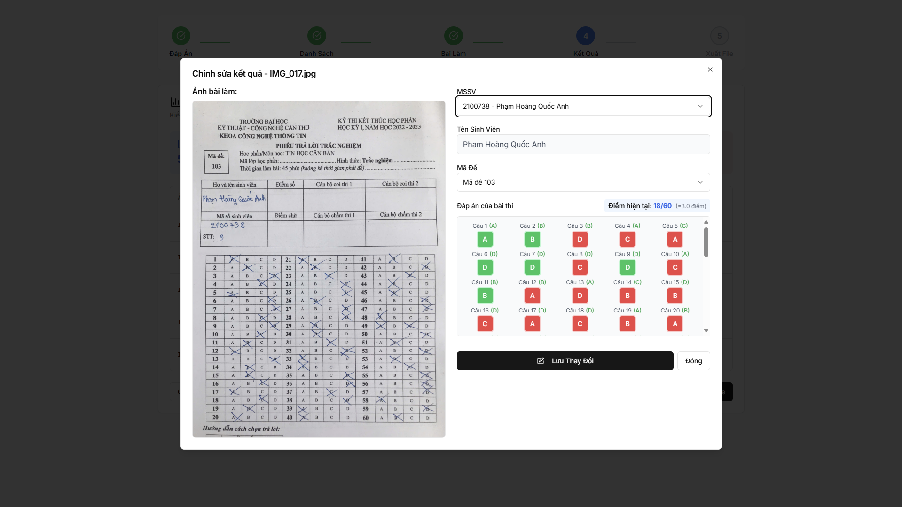
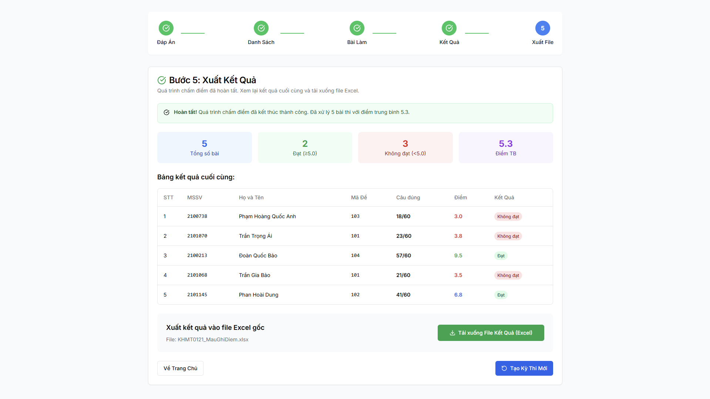

# Hệ Thống Chấm Thi Trắc Nghiệm Tự Động
### (Automatic Multiple-Choice Exam Grading System)

    

Giải pháp hiện đại giúp giáo viên chấm thi trắc nghiệm một cách nhanh chóng, chính xác và tiện lợi. Hệ thống sử dụng công nghệ xử lý ảnh và AI để tự động hóa toàn bộ quy trình, từ nhận diện thông tin đến chấm điểm và xuất báo cáo.

---

## ✨ Tính Năng Nổi Bật / Key Features

-   📋 **Tải lên đáp án linh hoạt**: Hỗ trợ tải lên file Excel chứa đáp án cho nhiều mã đề khác nhau trong một kỳ thi.
-   👥 **Quản lý danh sách thông minh**: Import danh sách sinh viên từ file Excel, tự động phân chia phòng thi.
-   📸 **Xử lý ảnh bài làm hàng loạt**: Upload và xử lý đồng thời nhiều ảnh bài làm của sinh viên.
-   🤖 **Nhận dạng bằng AI**: Tự động trích xuất Mã số sinh viên (MSSV), Mã đề, và các câu trả lời từ ảnh chụp bài làm bằng công nghệ AI (sử dụng Ollama).
-   ✅ **Chấm điểm tự động**: Đối chiếu câu trả lời của sinh viên với đáp án tương ứng của mã đề để tính điểm chính xác.
-   📊 **Kiểm tra và Chỉnh sửa trực quan**: Giao diện cho phép xem lại kết quả nhận dạng trên từng bài thi, so sánh với ảnh gốc và chỉnh sửa các thông tin sai lệch (MSSV, Mã đề, câu trả lời) nếu cần.
-   📄 **Xuất kết quả chuyên nghiệp**: Tổng hợp và xuất toàn bộ kết quả chấm thi ra file Excel với đầy đủ thông tin chi tiết.

---

## 🚀 Luồng Hoạt Động Của Hệ Thống / System Workflow

Hệ thống được thiết kế theo quy trình 5 bước đơn giản và logic.

### Bước 1: Tải Lên Đáp Án
Tải lên file Excel chứa đáp án cho tất cả các mã đề của kỳ thi.

### Bước 2: Tải Lên Danh Sách Lớp
Tải lên file Excel chứa danh sách sinh viên tham gia kỳ thi.

### Bước 3: Tải Lên & Xử Lý Bài Làm
Tải lên ảnh chụp các bài làm của sinh viên. Hệ thống sẽ tự động xử lý và nhận dạng thông tin.

### Bước 4: Xem Lại & Chỉnh Sửa
Kiểm tra kết quả nhận dạng. Nếu có sai sót, người dùng có thể dễ dàng chỉnh sửa lại cho chính xác.

*Giao diện chỉnh sửa chi tiết cho phép so sánh trực tiếp với ảnh gốc:*

### Bước 5: Xuất Kết Quả
Sau khi hoàn tất, hệ thống sẽ tổng hợp và cho phép tải xuống file Excel chứa bảng điểm cuối cùng.

---

## 🛠️ Công Nghệ Sử Dụng / Tech Stack

### Frontend
-   **Framework**: Next.js 14+
-   **Language**: TypeScript
-   **Styling**: Tailwind CSS
-   **UI Components**: shadcn/ui
-   **State Management**: Zustand

### Backend
-   **Framework**: FastAPI
-   **Language**: Python 3.10+
-   **Image Processing**: OpenCV
-   **Data Handling**: Pandas

### AI / Machine Learning
-   **OCR & Vision**: Ollama
-   **Model**: `qwen2.5vl:3b` (hoặc các model Vision-Language khác)

---

